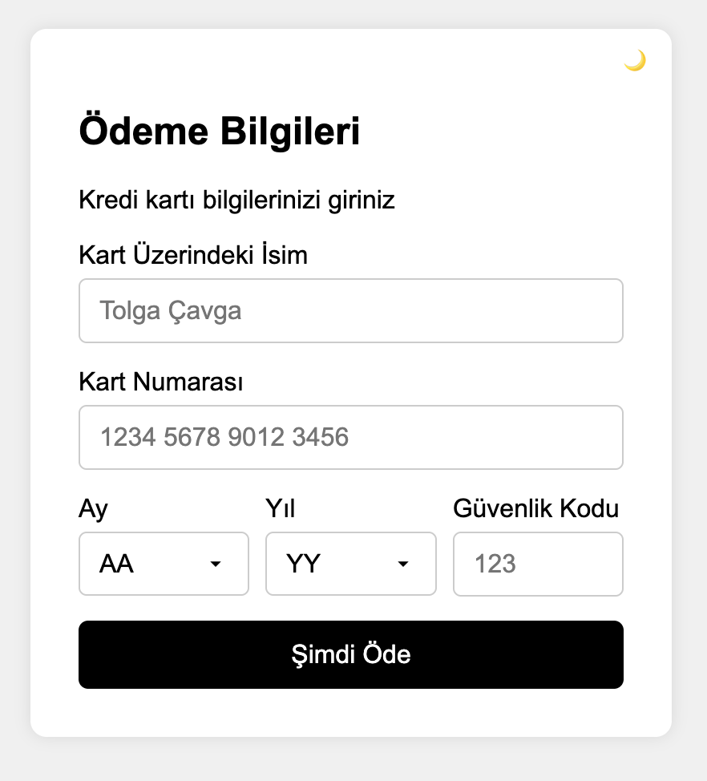
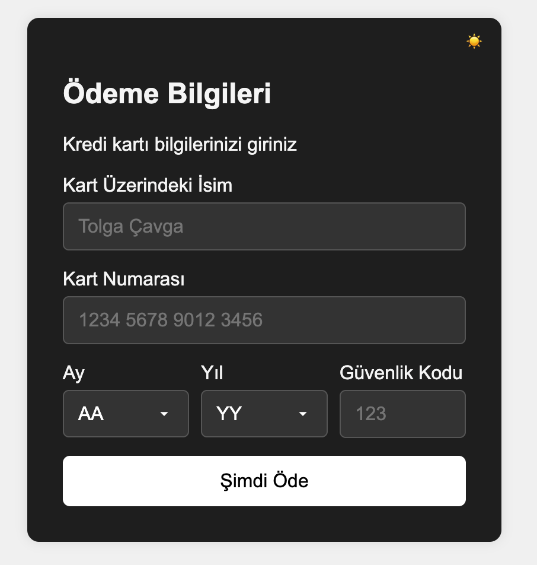

# 💳 Ödeme Formu Uygulaması (React + Dark Mode + Mobil Uyumlu)

Bu proje, React kullanılarak geliştirilmiş bir kredi kartı ödeme formu uygulamasıdır.  
Amaç, kullanıcıdan kredi kartı bilgilerini alarak `alert()` ile görüntülemek ve form verilerini **useState** ile kontrol etmektir.

---

## 🖼️ Uygulama Görselleri

### ☀️ Aydınlık Mod



### 🌙 Karanlık Mod



---

## 🖼️ Uygulama Özellikleri

- ✅ React (Fonksiyonel bileşenlerle)
- ✅ `useState` hook kullanımı
- ✅ Gerçek zamanlı input kontrolü
- ✅ Dark/Light Mod geçişi
- ✅ Mobil uyumlu responsive tasarım
- ✅ 4’erli gruplarla kart numarası biçimlendirme
- ✅ Kart ismi sadece harf kabul eder
- ✅ Ay ve yıl dinamik olarak oluşturulur
- ✅ CVV alanı sadece 3 haneli sayılarla sınırlı
- ✅ Tarayıcılar arası uyumlu `<select>` tasarımı (Safari, Chrome, Brave)

---

## 🛠️ Kurulum & Çalıştırma

Projenizi bilgisayarınıza klonladıktan sonra:

```bash
git clone https://github.com/cavga1903/odeme-formu.git
cd odeme-formu
npm install
npm start
```

## 🗂️ Proje Dosya Yapısı

```bash
src/
├── assets/
│   ├── form-light.png
│   └── form-dark.png
├── components/
│   ├── PaymentForm.jsx
│   └── PaymentForm.css
├── App.js
├── index.js
├── index.css
README.md
```

## 🧪 Öğrenilen Konular

## 🧠 Bu proje sayesinde aşağıdaki React konularında pratik yapılmıştır

- useState ile form kontrolü
- Controlled components mantığı
- React’te dinamik `"<select>"` üretimi
- Regex ile input filtreleme (sadece harf, sadece sayı)
- CSS ile dark mode yönetimi
- Tarayıcı uyumlu `"<select>"` ok tasarımı
- Mobil uyumlu responsive tasarım

## 📞 İletişim

- 📧 E-posta: <cavgaa228@gmail.com>
- 💼 [GitHub: @cavga1903](https://github.com/cavga1903)

### 📬 Sorularınız varsa çekinmeden ulaşabilirsiniz
